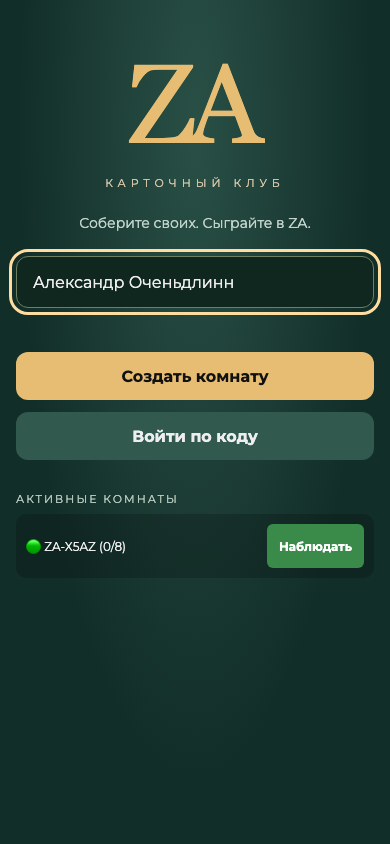
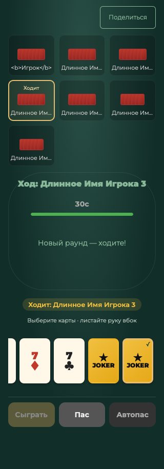
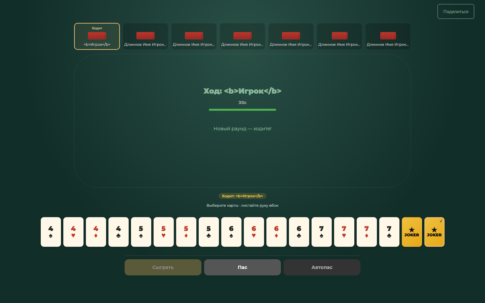
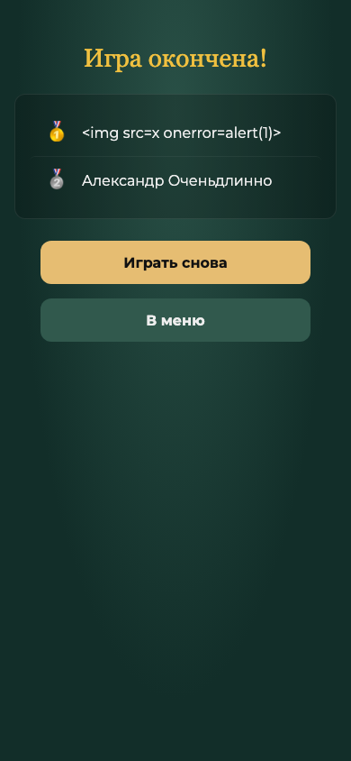

# Verification report — September 5, 2026

The stabilization release is deployed; a full production browser game passed. Physical mobile acceptance remains outstanding.

## Automated server checks

Node.js 24.14.0 on macOS 26.6.2. `npm test`: 14 passing tests including two nested complete-game cases.

- Room creation/join, 54 unique dealt cards, private hands, host authority and invalid phase transitions.
- Null, wrong-type, missing, duplicate and invalid-card payloads rejected without state changes or process termination.
- Private reconnect token required; public identifiers and wrong tokens rejected; an active copied tab cannot take over; own hand and host status restored.
- Confirmed move survives SIGKILL and restart; all players return to the saved game.
- A stale revision cannot execute a repeated move.
- Complete 3-player and 8-player games, standings, and return to lobby.
- Simulated snapshot-write failure sends no successful play event and makes health unhealthy; durable snapshot unchanged.
- Corrupt snapshot rejected rather than reset.
- Last combination's author has finished: both remaining players must respond before clearing the trick, for manual pass and a real 30-second timer pass.

Combo recognition and ranking code is preserved from the baseline. Full games exercise single-card play, pass and finish; exhaustive generated coverage of all joker/combo permutations is not claimed.

- Previous snapshot is recoverable; an oversized snapshot is rejected without modifying the current durable file.
- Fully disconnected rooms disappear from the public list but remain in durable storage for legitimate return.

## Browser checks

Playwright 1.62.1, headless browser builds on macOS 26.6.2:

| Engine | Version | Result |
|---|---|---|
| Chromium | 151.0.7922.34 | Passed |
| Firefox | 153.0 | Passed |
| WebKit | 26.5 | Passed |

Each engine: widths 320, 360, 390, 430, 768, 1024, 1440; low landscape 740 × 360; creation, eight-player lobby, game, 18-card visual stress fixture, last-card scrolling/selection, 44px action targets, no document horizontal overflow, keyboard selection, reload/rejoin, simulated offline/return, results escaping. No page JavaScript errors recorded. Stress-fixture hands and result strings are local rendering inputs, not server gameplay assertions.

Separate full UI game: three independent Chromium browser contexts (390px mobile-sized viewport and desktop), 72 turns in the recorded run, play/pass, complete standings, results refresh and host rematch. This caught and fixed rematch-button visibility after refreshing results.

Visual inspection of saved mobile and desktop screenshots caught and fixed opponent card backs overflowing their tiles. Selection is accessible by keyboard and pointer; selected cards keep their DOM node so focus and hand scroll do not jump during selection. Reduced-motion CSS and zoom-enabled viewport are present.

## Dependency and reproducibility checks

Clean npm installation uses the committed lockfile. `npm run check` verifies server, store and inline client syntax. Audit after the compatible qs override: zero known vulnerabilities in installed dependencies. The override remains necessary while Express 4 transitive requirements select an affected qs version. GitHub Actions runs installation, syntax checks, tests and audit on Node 24. CI completion is recorded in the PR, separately from local results.

## Synthetic performance check

Chromium with 4× CPU slowdown, 150ms network latency and 200,000 bytes/s download: local page reached network-idle in 1,704ms; 100 selection toggles took 1.2ms of synchronous script execution. This is a diagnostic sample, not a real-device INP or production performance guarantee.

## Physical and production acceptance still required

- Real iPhone Safari, Android Chrome, Samsung Internet, their current/previous major versions.
- Native desktop Safari/Chrome/Edge release builds (engine tests above are not those products).
- Messenger in-app browsers; opening externally if their transport/storage restrictions prevent play.
- Real phone lock/unlock, application switching, Wi-Fi to mobile-network handover, safe areas and software keyboards.
- Physical midrange-phone responsiveness and production network latency.
- Post-deploy full game/reconnect on physical phones. Railway volume, healthy deployment and desktop/mobile-sized browser full game are verified. Managed off-volume backups remain unavailable on the existing Hobby plan; a bounded previous snapshot is maintained on the attached volume.

These items are **not verified**. The branch is not evidence of universal phone compatibility. The current local tests do not replace real-device acceptance.

## Visual examples

## Production acceptance

Initial release: Docker/Node 24 build successful; health HTTP 200; served HTML matches the reviewed source; main-branch CI passed. Full three-context Chromium browser game passed with 69 turns and no page errors, including in-game refresh/reconnect, results refresh, rematch and leaving the room. The first remote harness run exposed timing assumptions in the test runner; the harness was changed to await all clients receiving a revision. An abandoned all-disconnected QA room expires normally and is hidden by the follow-up change. No user games were modified for testing.
